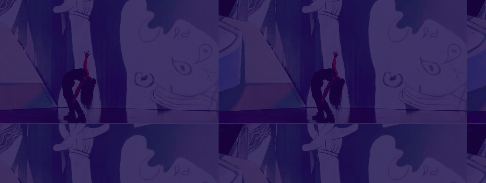

<!-- 
 -->
## Daniela Gallegos Dupuis

Hi, I am Dani, a Computer Science student at the University of Victoria. Whether it is writing a simple python program to do my homework, collaborating worldwide, or challenging myself with an open-ended school assignment, computer science opened a whole world of possibilities since print("Hello World") 

- [website](https://danigallegdup.github.io/)

- [Resume](./Daniela's%20Resume.pdf) 

- [LinkedIn](https://www.linkedin.com/in/danigallegdup/)

- [Instagram](https://www.instagram.com/_dani.gd/)

<!--

<picture>
  <source media="(prefers-color-scheme: dark)" srcset="https://raw.githubusercontent.com/danigallegdup/danigallegdup/output/github-contribution-grid-snake-dark.svg">
  <source media="(prefers-color-scheme: light)" srcset="https://raw.githubusercontent.com/danigallegdup/danigallegdup/output/github-contribution-grid-snake.svg">
  
</picture>

_generated with [Platane/snk](https://github.com/Platane/snk)_

**danigallegdup/danigallegdup** is a ✨ _special_ ✨ repository because its `README.md` (this file) appears on your GitHub profile.

Here are some ideas to get you started:

- 🔭 I’m currently working on ...
- 🌱 I’m currently learning ...
- 👯 I’m looking to collaborate on ...
- 🤔 I’m looking for help with ...
- 💬 Ask me about ...
- 📫 How to reach me: ...
- 😄 Pronouns: ...
- ⚡ Fun fact: ...
-->
